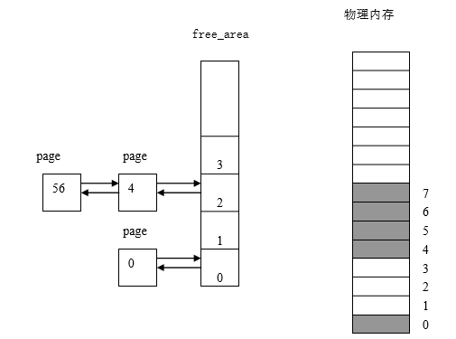

## 4.3 请页机制

&emsp; &emsp;当一个进程运行时，CPU访问的地址是用户空间的虚拟地址（逻辑地址）。Linux采用请页机制来节约物理内存，也就是说，推迟物理内存页帧的分配，它仅仅把当前要使用的用户空间中的少量页装入物理内存，这样做主要的好处就是可以防止系统内存的浪费。试想一下，运行一个8M大小的程序，其实际可能只需要使用其中2M大小的数据，使用请页机制时，就可以根据实际运行时的缺页请求去申请对应的物理内存，也就是2M大小而不是程序的8M大小。当访问的虚存页面尚未装入物理内存时，处理器将向Linux 报告一个页故障及其对应的故障原因。 页故障的产生有三种原因：

1.  程序编程出现错误，例如，要访问的虚拟地址无效，Linux 将向进程发送一个信号并终止进程的运行；

2.  虚地址有效，出错地址位于内核空间，即内核空间引发的缺页异常[^1]，可能是vmalloc分配内核空间内存引发的异常；

3.  虚地址有效，出错地址位于用户空间，即用户空间引发的缺页异常，该部分可能是由于要访问的虚地址被写保护（写时复制机制）、页被换出（swap）、页确实不存在物理内存中等原因引起。

### 4.3.1 缺页异常处理程序

&emsp; &emsp;当一个进程执行时，如果CPU访问到一个有效的虚地址，但是这个地址对应的页没有在物理内存中，则CPU产生一个缺页异常，同时将这个虚地址存入CR2寄存器（缺页线性地址寄存器cr2），然后调用缺页异常处理程序do_page_fault()。Linux的缺页异常处理程序必须对产生缺页的原因进行区分：是由编程错误所引起的异常，还是由访问进程地址空间的页但还尚未分配物理页面所引起的异常。

&emsp; &emsp;下面我们首先给出缺页异常处理程序的总体方案如图4.11所示，随后给出其详细流程图，其中的“地址”指当前进程执行时引起缺页的虚地址，“虚存区”指该地址所处的虚存区。SIGSEGV是当一个进程执行了一个无效的内存引用，或发生段错误时发送给它的信号，OOPS即Linux内核的不正确行为。

<div style="text-align: center">
 
</div>
<center>图4.11  缺页异常处理程序的总体方案</center>

实际上，缺页异常处理程序必须处理多种更细的特殊情况，它们不宜在总体方案中列出，详细流程图如图4.12。
<div style="text-align: center">

</div>

<center>图4.12 缺页异常处理程序流程图</center>

缺页异常处理程序do_page_fault()主要封装了__do_page_fault()函数实现，源代码中的核心语句如下：
```
static void __kprobes
__do_page_fault(struct pt_regs *regs, unsigned long error_code)
{
     ……
    //获取当前CPU正在运行的进程描述符，获取其内存描述符mm_struct
    tsk = current;
    mm = tsk->mm; 

    /*从缺页线性地址寄存器cr2中获取错误的线性地址 */
    address = read_cr2();
    ……
    //判断页访问出错的地址是不是位于内核地址空间,address>=TASK_SIZE_MAX
    if (unlikely(fault_in_kernel_space(address))) {
        //检查标志位确定触发异常时是否在内核态，
        if (!(error_code & (PF_RSVD | PF_USER | PF_PROT))) {
            /** error_code检查,满足 PF_RSVD  PF_USER  PF_PROT 三位均为0，含义如下
                      未使用保留位、位于内核空间、页面没找到  */
            if (vmalloc_fault(address) >= 0) //处理vmalloc异常
                return;

            if (kmemcheck_fault(regs, address, error_code))
                return;
        }

        //异常发生在内核地址空间，但不属于上边的情况，可能是由陈旧的TLB条目造成的异常引起的
        if (spurious_fault(error_code, address))
            return;
        ……
        /* 函数执行到此处，则说明这次异常是由于访问了非法的地址造成的，
        * 在内核中产生这种结果一般分用户空间和内核空间两种情况：
              1.在用户空间访问，会直接发送SIGSEGV 段错误信号
              2.在内核空间访问会分为两种情况：
        *      a. 用户空间传递的系统调用参数，访问了无效的地址；
        *      b. 内核的程序设计缺陷
        */
        bad_area_nosemaphore(regs, error_code, address);
        return;
    }
    //为用户空间地址，若使用了保留位，打印信息，杀死当前进程
    if (unlikely(error_code & PF_RSVD))
        pgtable_bad(regs, error_code, address);
    
    /* 1. in_atomic()判断当前状态是否处于中断上下文或禁止抢占状态，如果是则说明系统运行在原子上下文；
	     2. 如果当前进程中没有mm_struct 数据结构，说明这是一个内核线程
	    满足1、2任何一个条件，则不能处理该错误  */
    if (unlikely(in_atomic() || !mm)) { 
        bad_area_nosemaphore(regs, error_code, address);
        return;
    }
    ……
    //寻找address所在的vma
    vma = find_vma(mm, address);
    if (unlikely(!vma)) {
        bad_area(regs, error_code, address);
        return;
    }
    //如果address地址大于当前vma的开始地址，则跳到good_area
    if (likely(vma->vm_start <= address))
        goto good_area;
    ……
good_area:
    //再次验证权限
    if (unlikely(access_error(error_code, vma))) {
        bad_area_access_error(regs, error_code, address);
        return;
    }

    //分配新页框
    fault = handle_mm_fault(mm, vma, address, flags);
    ……
}
```
&emsp; &emsp;在该函数中首先获取当前CPU正在运行的进程描述符task_struct、内存描述符mm_struct，从缺页线性地址寄存器cr2中读取引起异常的虚拟地址，接下来判断异常地址address位于内核地址空间还是位于用户地址空间:    
a. 地址位于内核空间，检查标志位确定是否在内核态触发异常，在内核态则可能是vmalloc 异常，调用vmalloc_fault()函数处理，否则调用spurious_fault()判断是不是由于陈旧的TLB（translation lookaside buffer，加速线性地址转换）页表缓存引起的伪异常。若以上原因都不是，则此次异常就是由于访问了非法地址（越界错误、段权限错误等）造成的，则会发送信号终止进程。    
b. 地址位于用户空间，会进行一系列异常原因判断（可能使用了保留位、发生在原子上下文或是一个内核线程等），大部分情况会继续往下执行，寻找address所在的虚拟内存区域vma，若该address是位于vma有效区域内，则调用handle_mm_fault()函数分配新的物理页框。

&emsp; &emsp;对有效的虚地址，如果是缺页异常，Linux必须区分页所在的位置，即判断页是在交换文件中，还是在可执行映像中。为此，Linux通过页表项中的信息区分页所在的位置。如果该页的页表项非空，但对应的页不在内存,则说明该页处于交换文件中，操作系统要从交换文件装入页。

&emsp; &emsp;如果错误由写访问引起，该函数检查这个虚存区是否可写。如果不可写，则对这种错误进行相应的处理；如果可写，则采用“写时复制”技术。

&emsp; &emsp;如果错误由读或执行访问引起，该函数检查这一页是否已经存在于物理内存中。如果在，错误的发生就是由于进程试图访问用户态下的一个有特权的页面（页面的User/Supervisor标志被清除），因此函数跳到相应的错误处理代码处（实际上这种情况从不发生，因为内核根本不会给用户进程分配有特权的页面）。如果不在物理内存，函数还将检查这个虚存区是否可读或可执行。

&emsp; &emsp;如果这个虚存区的访问权限与引起缺页异常的访问类型相匹配，则调用handle_mm_fault()函数，该函数确定如何给进程分配一个新的物理页面：

1.  如果被访问的页不在内存，也就是说，这个页还没有被存放在任何一个物理页面中，那么，内核分配一个新的页面并适当地初始化；这种技术称为“**请求调页”**。

2.  如果被访问的页在内存但是被标为只读，也就是说，它已经被存放在一个页面中，那么，内核分配一个新的页面，并把旧页面的数据拷贝到新页面来初始化它；这种技术称为“**写时复制”**。

### 4.3.2 请求调页

&emsp; &emsp;术语“请求调页”指的是一种动态内存分配技术，它把页面的分配推迟到不能再推迟为止，也就是说，一直推迟到进程要访问的页不在物理内存时为止，由此引起一个缺页异常。

&emsp; &emsp;请求调页技术的引入主要是因为进程开始运行时并不访问其地址空间中的全部地址；事实上，有一部分地址也许进程永远不使用。此外，程序的局部性原理保证了在程序执行的每个阶段，真正使用的进程页只有一小部分，因此临时用不着的页根本没必要调入内存。相对于全局分配（一开始就给进程分配所需要的全部页面，直到程序结束才释放这些页面）来说，请求调页是首选的，因为它增加了系统中的空闲页面的平均数，从而更好地利用空闲内存。从另一个观点来看，在内存总数保持不变的情况下，请求调页从总体上能使系统有更大的吞吐量。

&emsp; &emsp;但是，系统为此也要付出额外的开销，这是因为由请求调页所引发的每个“缺页”异常必须由内核处理，这将浪费CPU的周期。幸运的是，局部性原理保证了一旦进程开始在一组页上运行，在接下来相当长的一段时间内它会一直停留在这些页上而不去访问其它的页：这样我们就可以认为“缺页”异常是一种稀有事件。

&emsp; &emsp;由上一小节可知，主要有内核空间引发的缺页异常和用户空间引发的缺页异常两种。对于内核空间中的缺页异常主要是由于vmalloc异常引起的，在进程调用vmalloc分配虚拟地址空间连续的内存时，只会更新内核空间的页表（所有进程共享），而并不会修改当前进程自己的页表，因此后续进程访问vmalloc返回的内存时会产生page fault，此时只需要将内核地址空间页表与当前进程页表进行同步即可。

&emsp; &emsp;对于用户空间引发的缺页异常，主要通过handle_mm_fault()函数确定如何分配一个新的物理页面给进程，在该函数中首先会进行pgd、pmd的分配，然后判断系统是否有使用大页（一般系统都使用4KB页面，如2MB或者4MB就称为大页，与4KB页面的分配有所区别，本书不详细讲解大页分配，感兴趣的学者可以自行查阅相关资料学习），若有使用大页就调用相应的函数进行物理页面的分配，否则调用handle_pte_fault()函数进行最终pte页表项的分配，在该函数中根据页表项所描述的物理页框是否在物理内存中(通过pte_present()宏判断，pte是PageTable Entry的缩写)，可以分为两种情况：   
1. 请求调页，被访问的页不在物理内存中，则需要分配一个物理页框；
2. 写时复制，被访问的页存在物理内存中，但是该页是只读的，目前需要对其进行写操作，此时内核将创建一个新的页框，然后将已存在的只读页框中的数据复制到新页框。

对于请求调页，在handle_pte_fault()函数中仍然需要细分为四种情况：
```
	if (!pte_present(entry)) {
		if (pte_none(entry)) {
			if (vma->vm_ops) {
				if (likely(vma->vm_ops->fault))
					return do_linear_fault(mm, vma, address,
						pte, pmd, flags, entry);
			}
			return do_anonymous_page(mm, vma, address,
						 pte, pmd, flags);
		}
		if (pte_file(entry))
			return do_nonlinear_fault(mm, vma, address,
					pte, pmd, flags, entry);
		return do_swap_page(mm, vma, address,
					pte, pmd, flags, entry);
	}
```
1. 通过pte_none()宏判断页表为空，则必须要分配页框。如果当前进程实现了vma操作函数中的fault钩子函数，也就是页与文件建立了映射关系，则属于基于文件的内存映射，调用do_linear_fault分配物理页框。否则，将调用匿名映射分配函数do_anonymous_page()实现。   
2. 如果检测出该页表项为非线性映射（pte_file(entry)），则调用do_nonlinear_fault()分配物理页。   
3. 如果页框事先被分配，但是此刻已经由主存换出到了外存(硬盘)，则调用do_swap_page()完成页框分配。

do_anonymous_page()函数分别处理写请求和读请求：

&emsp; &emsp;当处理写访问时，该函数调用伙伴算法中的alloc_pages()函数分配一个新的页面，并把新页面填为0。最后，把页表相应的表项置为新页面的物理地址，并把这个页面标记为可写和脏两个标志。

&emsp; &emsp;相反，当处理读访问时(所访问的虚存区可能是未初始化的数据段bss)，因为进程正在对它进行第一次访问,因此页的内容是无关紧要的。给进程一个填充为0的页面要比给它一个由其它进程填充了信息的旧页面更为安全。Linux在请求调页方面做得更深入一些。没有必要立即给进程分配一个填充为零的新页面，我们可以给它一个现有的称为“零页”的页，这样可以进一步推迟页面的分配。“零页”在内核初始化期间被静态分配，并存放在empty_zero_page变量中（一个有1024个长整数的数组，并用0填充）；因此页表项被设为零页的物理地址：

&emsp; &emsp;由于“零页”被标记为不可写，如果进程试图写这个页，则写时复制机制被激活。当且仅当在这个时候，进程才获得一个属于自己的页面并对它进行写。

### 4.3.3 写时复制

&emsp; &emsp;第一代Unix系统实现了一种傻瓜式的进程创建：当发出fork()系统调用时，内核原样复制父进程的整个用户地址空间并把复制的那一份分配给子进程。这种行为是非常耗时的，因为它需要：

1.  为子进程的页表分配页面

2.  为子进程的页分配页面

3.  初始化子进程的页表

4.  把父进程的页复制到子进程相应的页中

&emsp; &emsp;这种创建地址空间的方法涉及许多内存访问，消耗许多CPU周期，并且完全破坏了高速缓存中的内容。在大多数情况下，这样做常常是毫无意义的，因为许多子进程通过装入一个新的程序开始它们的运行，这样就完全丢弃了所继承的地址空间。

&emsp; &emsp;写时复制(Copy-on-write)是一种可以推迟甚至免除拷贝数据的技术。内核此时并不需要立即复制整个进程空间，而是让父进程和子进程共享同一个拷贝。只有在需要写入的时候，数据才会被复制，从而使各个进程拥有各自的拷贝。也就是说，资源的复制只有在需要写入的时候才进行，在此之前，以只读方式共享。这种技术使地址空间上的页的拷贝被推迟到实际发生写入的时候。有时共享页根本不会被写入，例如，fork()后立即调用exec()，就无需复制父进程的页了。fork()的实际开销就是复制父进程的页表以及给子进程创建唯一的PCB。这种优化可以避免拷贝大量根本就不会使用的数据（地址空间里常常包含数十兆的数据）。

&emsp; &emsp;在handle_pte_fault()函数中通过pte_present()宏判断页存在于物理内存中，但是对应的页有写保护，不可写，此时就会触发写时复制缺页中断，调用do_wp_page()函数完成页面的分配。如下代码所示：
```
	/* pte有映射物理页面，但是因为之前的pte设置为了只读，不可写，现在需要写操作，
	 * 所以触发了写时复制缺页中断，调用do_wp_page完成写时复制 */
	if (flags & FAULT_FLAG_WRITE) { 
		if (!pte_write(entry))
			return do_wp_page(mm, vma, address,
					pte, pmd, ptl, entry);
		entry = pte_mkdirty(entry);
	}	
```
