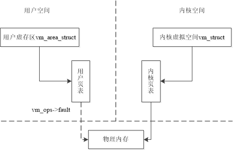
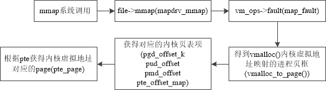

## 4.6 内存管理实例

&emsp; &emsp;我们希望能通过访问用户空间的内存达到读取内核数据的目的，这样便可进行内核空间到用户空间的大规模信息传送，从而应用于高速数据采集等性能要求高的场合。

&emsp; &emsp;因为通过外设采集的数据首先会由驱动程序放入内核，然后才传送到用户空间由应用程序做进一步的处理。而我们知道由于内核内存是受保护的，因此，要想将其数据拷贝到用户空间，通常的方法是利用系统调用，但是系统调用的缺点是速度慢，这会成为数据高速处理的瓶颈。因此我们希望可以从用户空间直接读取内核数据，从而省去了数据在两个空间拷贝的过程。

&emsp; &emsp;具体地讲，我们要利用内存映射功能，将内核中的一部分虚拟内存映射到用户空间，使得访问用户空间地址等同于访问被映射的内核空间地址，从而不再需要数据拷贝操作了。

#### 4.6.1 相关背景知识

&emsp; &emsp;我们知道，在内核空间中调用kmalloc()分配连续物理空间，而调用vmalloc()分配非物理连续空间。在这里，我们把kmalloc()所分配内核空间中称为**内核逻辑空间（Kernel Logic Space）**。它所分配的内核空间虚地址和物理地址都是连续的，两者是线性映射关系，所以很容易获得其对应的实际物理地址，即“内核虚地址－PAGE_OFFSET＝实际的物理地址”。另外，由于系统在初始化时就建立了内核页表“swapper_pg_dir”，而kmalloc()分配过程所使用的就是该页表，因此也省去了建立和更新页表的工作。

&emsp; &emsp;我们把vmalloc()分配的内核空间中称为**内核虚拟空间（Kernel Virtual Space,简称KVS）**，它的映射相来说较复杂，这是因为其分配的内核空间位于非连续区，如图4.17所示。vamlloc()分配的内核空间地址所对应的物理地址并非可通过简单线性运算获得，从这个意义上说，它的物理地址在分配前是不确定的，虽然vmalloc()分配空间与kmalloc()一样都是由内核页表来映射的，但vmalloc()在分配过程中须更新内核页表[^2]。

[^2]: 内核页表把内核空间映射到物理内存，其中vmalloc和kmalloc分配的物理内存都由内核页表描述；同理用户页表把用户空间映射到物理内存。

### 4.6.2 代码体系结构介绍

我们将试图写一个虚拟字符设备驱动程序（参见第九章），通过它将系统**内核空间映射到用户空间**。跨空间的地址映射主要包括：

**1) 找到内核地址对应的物理地址，这是为了将用户页表项直接指向这些物理地址**；

**2) 建立新的用户页表项**。

&emsp; &emsp;因为用户空间和内核空间映射到了同一物理地址，这样以物理地址为中介，用户进程寻址时，通过自己的用户页表就能找到对应的物理内存，因此访问用户空间就等于访问了内核空间。

##### 1. 实例蓝图

&emsp; &emsp;如前所述，我们把内核空间分为**内核逻辑空间**和**内核虚拟空间**，我们的目标是把vmalloc()分配的**内核虚拟空间**映射到用户空间。（这里没有选择kmalloc()，是因为它的映射关系过于简单，而作为教学，我们主要目的就是找到内核地址对应的物理地址，因此我们选择更为复杂的内核虚拟空间，它更能体现映射场景）。

&emsp; &emsp;我们知道，用户进程操作的是虚存区vm_area_struct，我们此刻需要利用用户页表将用户虚存区映射到物理内存，如图4.18所示。这里主要工作便是建立用户页表项，从而完成映射工作。这个操作由用户虚拟区操作表中的vma->fault[^3]方法完成，当发生“缺页”时，该方法会帮助我们动态构造被映射物理内存的用户页表项。（注意这里并非一次就全部映射我们所需要的空间，而是在缺页时动态地一次一次地在现场完成映射）。

>1. 内核页表把内核空间映射到物理内存，其中vmalloc和kmalloc分配的物理内存都由内核页表描述；同理用户页表把用户空间映射到物理内存。

>2. 除了使用fault动态地一次一页构造用户页表项外，还可以调用remap_page_range()方法一次构造一段内存范围的页表项，但显然这个方法是针对物理内存连续被分配时使用的，而这里内核虚拟空间对应的物理内存并非连续，所以这里使用fault。

<div style="text-align: center">

</div>

<br/><center>(虚线箭头表示需要建立的新映射关系。 实线箭头表示已有的映射关系)</center></br>  
<center>图4.18 用户虚存区映射到内核虚拟空间对应的物理内存</center>    

&emsp; &emsp;为了把能够将用户空间的虚存区映射到内核虚拟空间对应的物理内存中，查看内核vmalloc()函数实现部分的源码，发现在Linux 3.10源码中存在vmalloc_to_page()函数可以实现将内核虚拟空间的地址转换到物理页面page，将vmalloc()函数的返回的内核虚拟空间中的地址经过四级页表进行转换，得到对应页表pte的地址，最后通过pte_page()函数得到对应的page结构。如下代码所示。
```
struct page *vmalloc_to_page(const void *vmalloc_addr)
{
	unsigned long addr = (unsigned long) vmalloc_addr;
	struct page *page = NULL;
	pgd_t *pgd = pgd_offset_k(addr);

	/*
	 * XXX we might need to change this if we add VIRTUAL_BUG_ON for
	 * architectures that do not vmalloc module space
	 */
	VIRTUAL_BUG_ON(!is_vmalloc_or_module_addr(vmalloc_addr));

	if (!pgd_none(*pgd)) {
		pud_t *pud = pud_offset(pgd, addr);
		if (!pud_none(*pud)) {
			pmd_t *pmd = pmd_offset(pud, addr);
			if (!pmd_none(*pmd)) {
				pte_t *ptep, pte;

				ptep = pte_offset_map(pmd, addr);
				pte = *ptep;
				if (pte_present(pte))
					page = pte_page(pte);
				pte_unmap(ptep);
			}
		}
	}
	return page;
}
```

我们需要实现fault方法，动态建立对应页表，而在该方法中核心任务是找到内核逻辑地址。这就需要我们做以下工作：

1.  找到vmalloc虚拟内存对应的内核页表，并寻找到对应的内核页表项。

2.  获取内核页表项对应的物理页面指针。

3.  通过页面得到对应的内核逻辑地址。

获得内核逻辑地址后，很容易获得对应的物理页面，这主要用于建立用户页表映射。到此，以物理页面为中介，我们完成了内核虚拟空间到用户空间的映射。

#### 2. 基本函数

&emsp; &emsp;我们利用一个虚拟字符驱动程序，将vmalloc()分配的一定长的内核虚拟地址映射到设备文件[^3]，以便可以通过访问文件内容来达到访问内存的目的。这样除了提高内存访问速度外，还可以让用户利用文件系统的编程接口访问内存，降低了开发难度。
 
&emsp; &emsp;Map_driver.c就是虚拟字符驱动程序。为了要完成内存映射，除了常规的open()/release()操作外，必须自己实现mmap()操作，该函数将给定的文件映射到指定的地址空间上，也就是说它将负责把vmalloc()分配的内核地址映射到设备文件上。

&emsp; &emsp;文件操作表中的mmap()是在用户进程调用mmap()系统调用时被执行的，而且在调用前内核已经给用户进程找到并分配了合适的虚存区vm_area_struct，这个区将代表文件内容，所以接着要做的是如何把虚存区和物理内存挂接到一起了，即构造页表。由于前面所说的原因，系统中页表需要动态分配，因此不可使用remap_page_range()函数一次分配完成，而必须使用虚存区操作中的fault方法，在现场一页一页地构造页表。

mmap()方法的主要操作是为它得到的虚存区绑定对应的操作表vm_operations_struct。于是构造页表的主要操作就由虚存区操作表的fault方法来完成。

fault方法主要操作是寻找到内核虚拟空间中的地址对应的物理页框page。

整个任务执行路径如图4.19所示。

<div style="text-align: center">

</div>

<center>图4.19 从mmap()到获得内核逻辑地址的执行路径</center>

> 3. Linux中的设备是一个广义的概念，不仅仅指物理设备。这里的设备实际上是指vmalloc()所分配的一块区域。之所以以设备驱动程序的方式实现，是为了把所实现的内容以模块的方式插入内核，有关模块的内容参见附录A。

### 4.6.3 一步一步 

编译map_driver.c为map_driver.ko模块，具体参数见Makefile

加载模块 ：insmod map_driver.ko

生成对应的设备文件

1) 在/proc/devices下找到map_driver对应的设备命和设备号：grep mapfile /proc/devices

2) 建立设备文件mknod /dev/mapfile c 254 0 （假如在我这里的设备号为254）

利用用户测试程序maptest读取/dev/mapfile文件，将存放在内核的信息打印到用户屏幕。

### 4.6.4 程序代码

首先，编写用户空间测试程序如下：

```c
#include<stdio.h>
#include<unistd.h>
#include<sys/mman.h>
#include<sys/types.h>
#include<fcntl.h>
#include<stdlib.h>
#define LEN (10*4096)

int main(void)
{
		int fd;
		char *vadr;
		
		if ((fd = open("/dev/mapdrv", O_RDWR)) < 0) {
				perror("open");
				exit(-1);
		}

		vadr = mmap(0, LEN, PROT_READ, MAP_PRIVATE | MAP_NORESERVE, fd, 0);
		if (vadr == MAP_FAILED) {
				perror("mmap");
				exit(-1);
		}

		printf("%s\n", vadr);
		close(fd);
		exit(0);
}
```

从上面我们可以清楚地看出，要映射的设备文件为/dev/mapdrv，所以我们在插入内核模块时应该进行如下操作：
```c
# insmod map_driver.ko
```
然后再/proc/devices文件中查找该设备对应的主设备号
```c
#grep map_driver /proc/devices
250 mapdrv
```

（假设你得到的数是251）
```c
#mknod /dev/mapdrv c 250 0
#gcc -Wall -o maptest maptest.c
# ./maptest
hello world from kernel space !
```
把所有251替换成你通过grep搜索到的那个主设备号即可。

内核模块代码如下：

```c
--------------map_driver.h--------------------
#include<asm/atomic.h>
#include<asm/semaphore.h>
#include<linux/cdev.h>
struct mapdrv{
		struct cdev mapdev;
		atomic_t usage;
};

---------------map_driver.c-------------------
#include<linux/kernel.h>
#include<linux/module.h>
#include<linux/fs.h>
#include<linux/string.h>
#include<linux/errno.h>
#include<linux/mm.h>
#include<linux/vmalloc.h>
#include<linux/slab.h>
#include<asm/io.h>
#include<linux/mman.h>

#include "map_driver.h"

#define MAPLEN (PAGE_SIZE*10)

int mapdrv_open(struct inode *inode, struct file *file);               /* 打开设备 */
int mapdrv_release(struct inode *inode, struct file *file);            /*关闭设备 */
int mapdrv_mmap(struct file *file, struct vm_area_struct *vma);        /*设备的mmap函数 */
void map_vopen(struct vm_area_struct *vma);                            /* 打开虚存区 */
void map_vclose(struct vm_area_struct *vma);                           /* 关闭虚存区 */
int map_fault(struct vm_area_struct *vma, struct vm_fault *vmf); 	/* 虚存区的缺页处理函数 */

static struct file_operations mapdrv_fops = {
        .owner = THIS_MODULE,
        .mmap = mapdrv_mmap,
        .open = mapdrv_open,
        .release = mapdrv_release,
};

static struct vm_operations_struct map_vm_ops = {
        .open = map_vopen,
        .close = map_vclose,
        .fault = map_fault,
};

static int *vmalloc_area = NULL;
static dev_t dev;

struct mapdrv* md;
MODULE_LICENSE("GPL");

static int __init mapdrv_init(void) /*驱动程序初始化 */
{
        unsigned long virt_addr;
        int result, err;
	struct page *page;
	long pfn;

	printk(KERN_INFO "insmod kernel module\n");
        dev = MKDEV(0, 0);
        md = kmalloc(sizeof(struct mapdrv), GFP_KERNEL);
        if (!md)
                goto fail1;

        result = alloc_chrdev_region(&dev, 0, 1, "mapdrv");
        if (result < 0) {
                printk(KERN_WARNING "mapdrv: can't get major.\n");
                goto fail2;
        }

        cdev_init(&md->mapdev, &mapdrv_fops);
        md->mapdev.owner = THIS_MODULE;
        md->mapdev.ops = &mapdrv_fops;
        err = cdev_add (&md->mapdev, dev, 1);
        if (err) {
                printk(KERN_NOTICE "Error %d adding mapdrv", err);
                goto fail3;
        }
        atomic_set(&md->usage, 0);

        vmalloc_area = vmalloc(MAPLEN); /* 在非连续区获得一块内存区*/
        if (!vmalloc_area)
                goto fail4;

        for (virt_addr = (unsigned long)vmalloc_area;
             virt_addr < (unsigned long)(&(vmalloc_area[MAPLEN / sizeof(int)]));
             virt_addr += PAGE_SIZE) {
                //SetPageReserved(virt_to_page(vaddr_to_kaddr((void *)virt_addr))); /*使缓存的页面常驻内存 */
		page = vmalloc_to_page((void*)virt_addr);
		page->flags |= PG_reserved;	/*设置page的PG_reserved标志，使缓存的页面常驻内存（不能换出） */
        }
        
        strcpy((char *)vmalloc_area, "hello world from kernel space !");          /*把信息放在内核空间，供用户读取*/

	pfn = vmalloc_to_pfn((void*)vmalloc_area);
        printk("vmalloc_area at 0x%p (pfn %ld)\n", vmalloc_area, pfn);

        return 0;
fail4:
        cdev_del(&md->mapdev);
fail3:
        unregister_chrdev_region(dev, 1);
fail2:
        kfree(md);
fail1:
        return -1;
}

static void __exit mapdrv_exit(void)
{
        unsigned long virt_addr;
	struct page *page;

        for (virt_addr = (unsigned long)vmalloc_area;
             virt_addr < (unsigned long)(&(vmalloc_area[MAPLEN / sizeof(int)]));
             virt_addr += PAGE_SIZE) {
		page = vmalloc_to_page((void*)virt_addr);
		page->flags &= ~PG_reserved;	/*内核模块退出，去除PG_reserved标志，页面可以被换出 */
        }

        if (vmalloc_area)
             vfree(vmalloc_area); /* 释放所分配的区间*/

        cdev_del(&md->mapdev);		/* 删除字符设备 */
        unregister_chrdev_region(dev, 1); /*注销设备号*/
        
	printk(KERN_INFO "unregister chrdev\n");
        kfree(md);
}

/* 打开设备的函数*/
int mapdrv_open(struct inode *inode, struct file *file)
{
        struct mapdrv *md;
        md = container_of(inode->i_cdev, struct mapdrv, mapdev); /*获得md的起始地址*/
        atomic_inc(&md->usage); /*引用数加1 */

        return (0);
}

/*关闭设备的方法*/
int mapdrv_release(struct inode *inode, struct file *file)
{
        struct mapdrv* md;
        md = container_of(inode->i_cdev, struct mapdrv, mapdev);
        atomic_dec(&md->usage); /*引用数减1 */
 
        return (0);
}

int mapdrv_mmap(struct file *file, struct vm_area_struct *vma)
{
        unsigned long offset = vma->vm_pgoff << PAGE_SHIFT; /* 求出偏移量*/
        unsigned long size = vma->vm_end - vma->vm_start;

        if (offset & ~PAGE_MASK) { /* 如果偏移量没有在页边界，说明没有对齐*/
                printk("offset not aligned: %ld\n", offset);
                return -ENXIO;
        }
        if (size > MAPLEN) {
                printk("size too big\n");
                return (-ENXIO);
        }

        /* 仅支持共享映射 */
        if ((vma->vm_flags & VM_WRITE) && !(vma->vm_flags & VM_SHARED)) {
                printk("writeable mappings must be shared, rejecting\n");
                return (-EINVAL);
        }

        vma->vm_flags |= VM_LOCKED; /*不要让这个区换出，锁住它*/
        if (offset == 0) {
                vma->vm_ops = &map_vm_ops;
                map_vopen(vma); /* 增加引用计数*/
        } else {
                printk("offset out of range\n");
                return -ENXIO;
        }
        return 0;
}

/* 打开虚存区的函数 */
void map_vopen(struct vm_area_struct *vma)
{
        /*当有人还在使用内存映射时，需要保护该模块以免被卸载 */
}

/* 关闭虚存区的函数 */
void map_vclose(struct vm_area_struct *vma)
{
}

/* 缺页处理函数 */
int map_fault(struct vm_area_struct *vma, struct vm_fault *vmf)
{
        unsigned long offset;

        /*确定vmalloc()所分配区中的偏移量 */
        offset = (unsigned long)vmf->virtual_address - (unsigned long)vma->vm_start;
        

	vmf->page = vmalloc_to_page(&vmalloc_area[offset/sizeof(int)]);
        get_page(vmf->page); /* 增加页的引用计数*/
        printk("map_drv: page fault for offset 0x%lx (pfn %ld)\n", offset,vmalloc_to_pfn(&vmalloc_area[offset/sizeof(int)]));
        return 0;
}
module_init(mapdrv_init);
module_exit(mapdrv_exit);
```
